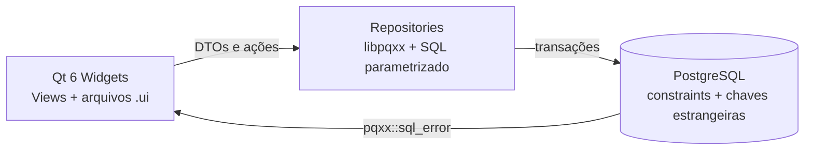

# Sistema de Logística TFD — Prefeitura de Piranga

> Aplicação desktop para planejar, registrar e consultar o transporte de pacientes em Tratamento Fora de Domicílio (TFD).


## Contexto

No TFD, uma viagem mal planejada pode impedir que um paciente chegue a uma consulta, exame ou procedimento essencial. Este projeto foi desenvolvido para apoiar a logística de saúde pública, com foco em integridade dos dados, rastreabilidade e uma experiência clara para a equipe responsável.

Mais do que um CRUD, é uma aplicação desktop voltada para um domínio sensível, no qual o histórico de transporte precisa ser preservado.

## Funcionalidades

- Cadastro, consulta, atualização e exclusão protegida de pacientes.
- Gestão de acompanhantes, motoristas e veículos.
- Planejamento de viagens com data, destino, veículo, motorista e pacientes.
- Vinculação opcional de um acompanhante por paciente em cada viagem.
- Consulta, edição e exclusão confirmada de viagens.
- Histórico de viagens por paciente.
- Relatório de volume de passageiros por período e mapa diário de viagens.
- Validação de CPF, telefone, placas e datas, incluindo anos bissextos.
- Interface desktop com Qt Widgets e formulários do Qt Designer.

## Arquitetura



### Decisões técnicas

- Repositórios executam SQL parametrizado e não escondem exceções do banco.
- A interface captura erros do PostgreSQL e os traduz em mensagens claras.
- `ON DELETE RESTRICT` protege o histórico vinculado a pacientes, motoristas, veículos e acompanhantes.
- A tabela associativa impede o mesmo paciente de entrar duas vezes na mesma viagem.
- Operações de viagem usam transações para preservar consistência.
- Entidades são DTOs puros; CPF e datas são validados por funções utilitárias sem estado.
- Credenciais ficam em variáveis de ambiente, nunca no código-fonte.
- A conexão com PostgreSQL exige TLS.

## Stack

| Camada | Tecnologia |
| --- | --- |
| Aplicação desktop | C++17 + Qt 6 Widgets |
| Interface | Qt Designer (`.ui`) |
| Banco de dados | PostgreSQL |
| Persistência | libpqxx |
| Build e testes | CMake + CTest |
| Segurança de transporte | TLS via PostgreSQL/libpq |

## Estrutura do projeto

```text
.
├── src/
│   ├── *Repository.*        # Persistência e transações
│   ├── View*.cpp/.h/.ui     # Telas Qt
│   ├── Entidades.h          # DTOs do domínio
│   ├── CpfUtils.h           # Validação de CPF
│   ├── DataUtils.h          # Conversão e validação de datas
│   ├── schema.sql           # Criação da base
│   └── migracao_*.sql       # Migrações
├── tests/
│   └── CoreUtilsTests.cpp   # Testes de CPF e datas
├── CMakeLists.txt
└── README.md
```

## Como executar

### Pré-requisitos

- Qt 6 Widgets;
- compilador com suporte a C++17;
- CMake 3.16 ou superior;
- PostgreSQL com TLS habilitado;
- libpq e libpqxx.

### Criar o banco

```powershell
createdb prefeitura_viagens
psql -d prefeitura_viagens -f src/schema.sql
```

### Atualizar um banco existente

Para preservar os dados ja cadastrados, aplique as migracoes abaixo uma unica vez:

```powershell
psql -d prefeitura_viagens -f src/migracao_auxiliares_relatorios.sql
psql -d prefeitura_viagens -f src/migracao_acompanhantes_por_viagem.sql
psql -d prefeitura_viagens -f src/migracao_paciente_uma_viagem_por_dia.sql
```

Os novos acompanhantes sao informados ao adicionar o paciente a viagem. Nao e necessario cadastra-los previamente.

### Configurar a conexão

Defina as variáveis no mesmo terminal que executará o aplicativo:

```powershell
$env:DB_HOST = "127.0.0.1"
$env:DB_PORT = "5432"
$env:DB_NAME = "prefeitura_viagens"
$env:DB_USER = "postgres"
$env:DB_PASSWORD = "sua-senha"
$env:DB_SSLMODE = "require"
```

Em produção, utilize `DB_SSLMODE=verify-full` e configure `DB_SSLROOTCERT` com o certificado da autoridade certificadora.

### Compilar e executar

```powershell
cmake -S . -B build
cmake --build build --parallel
.\build\sistema_prefeitura.exe
```

### Executar os testes

```powershell
ctest --test-dir build --output-on-failure
```

## Distribuição no Windows

A pasta `Sistema-Logistica-Prefeitura` é a versão portátil do aplicativo. Ela inclui as DLLs do Qt, PostgreSQL/libpqxx e plugins necessários. Para o GitHub, mantenha essa pasta fora do controle de versão e publique-a como arquivo `.zip` em uma **GitHub Release**.

## Próximas evoluções

- Autenticação com perfis de acesso e trilha de auditoria.
- Exportação de relatórios em PDF.
- Indicadores operacionais para frota e demanda.
- Testes de integração com uma instância PostgreSQL isolada.

---

Projeto desenvolvido para demonstrar arquitetura desktop em C++, integração segura com PostgreSQL e cuidado com dados em um contexto de saúde pública.
